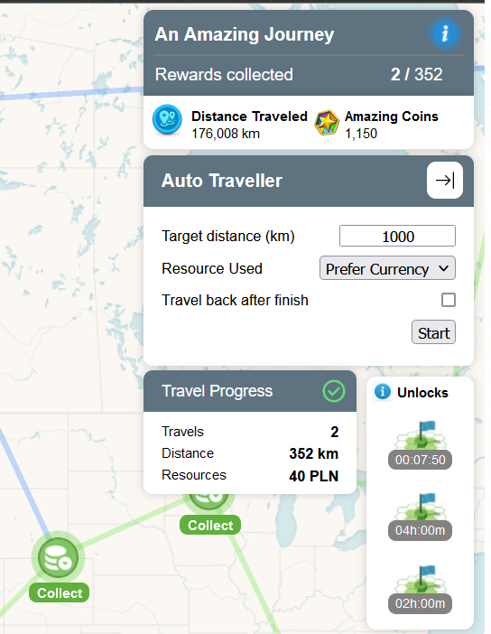

# Stuff++ Unlocked

Features extension script for eRepublik.com.

## Installation

1. Install [Tampermonkey](https://www.tampermonkey.net/).
2. Open [Stuff++ unlocked url](https://github.com/Humberd/Stuff-unlocked/raw/master/src/index.user.js).
3. Tampermonkey page should appear. Install the script.
4. Refresh your eRepublik page.
5. That's all!

## Donators badge

Players who support this project
will have their avatars decorated with an animated border:

#### On a battlefield

#### On your feed and articles

### Donation rewards
| 1M+ in currency                                                                                                                    | 3M+ in currency                                                                                                                    | 5M+ in currency                                                                            |
|------------------------------------------------------------------------------------------------------------------------------------|------------------------------------------------------------------------------------------------------------------------------------|--------------------------------------------------------------------------------------------|
|  |  | [Choose your custom border](https://store.steampowered.com/points/shop/c/avatar/cluster/1) |

### How to donate?

1. Go to [this profile](https://www.erepublik.com/en/citizen/profile/4659830).
2. Donate money.
3. Your border should appear to other Sutff++ unlocked users in max 1 day. 

If you donate 5M+ in total you can write me a message specifying
which [border you choose](https://store.steampowered.com/points/shop/c/avatar/cluster/1).

## Features

### Basic

Basic feature inherited from Zordacz's old version.

### Auto Traveller

* Automatically travels to the next region in the journey.

### PowerSpin Auto-Spinner

* Display Power Spin Log.
* Auto spin until a money limit is reached,
* Or when we reach the 3rd Jackpot.
* Drastically improves spin animation speed allowing rolling again nearly instantly.

### Daily Challenge reward collector

* Claim All button to collect all daily challenges.

### Feed comments scroll

# Development

## Installation
Run `npm ci` to install dependencies.

## Local build
Run `npm start` to start development server.

Copy absolute disk path to `dist/index-dev.user.js` and paste it into URL of your browser.
It should be similar to `D:\Repositories\Stuff-unlocked\dist\index-dev.user.js`.
This will install the script in Tampermonkey.

You will have to disable production script, so that only the DEV one is active.

Now everytime you make a change in the code, the erepublik page should refresh automatically.

## Production build
Run `npm run build` to build the project. The build artifacts will be stored in the `dist/` directory.

## Old stuff
The old (non-React) version of the script is in `src/old-index.user.js`.
It is appended during a build phase to `index.user.js` file.
In result the `index.user.js` file contains both old and new version of the script.

`index.user.js` = `src/userscript-header.js` + `src/old-index.user.js` + React build artifacts.
